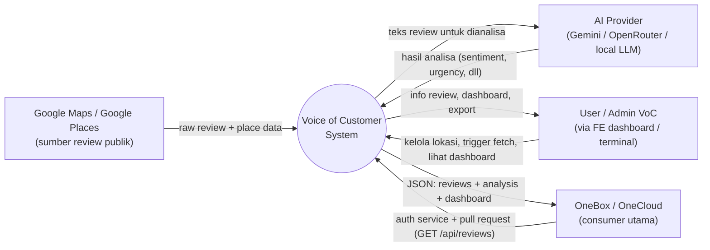
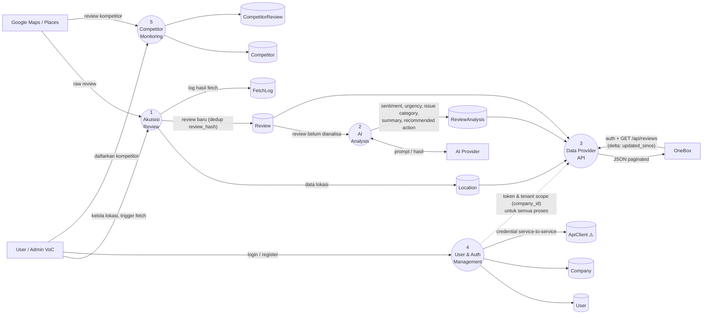

# Voice of Customer System — DFD (Draft v1)

> **Status:** draf high-level, belum di-detailing.
> **Grounding:** proses dipetakan dari struktur nyata `app/services/*` dan `app/integrations/*` ✅.
> **Konvensi:** mengikuti gaya [onebox_system/dfd.md](../onebox_system/dfd.md) — lingkaran = proses, kotak = external entity, silinder = data store.
> **Companion:** [erd.md](erd.md) (rancangan struktur data target).

---

## DFD Level 0 — Context Diagram

Satu proses tunggal: **Voice of Customer System**. Empat external entity.

**Interpretasi:** VoC System duduk di tengah 4 dunia — narik dari Google, minjem otak AI provider, dikelola user internal, dan **menyuplai OneBox** (arah integrasi utama sesuai MUST_READ: OneBox = consumer, pull via REST).

---

## DFD Level 1 — Dekomposisi

Lima proses inti (dipetakan dari `app/services/`) + 1 proses usulan fase lanjut:

| # | Proses | Sumber kode | Data store yang disentuh |
|---|--------|-------------|--------------------------|
| 1 | **Akuisisi Review** (fetch/crawl) | `fetch_service`, `selenium_fetch_service`, `google_places_client`, `selenium_google_maps_client` | Source, Location, FetchSchedule, Review, FetchLog |
| 2 | **AI Analysis** | `analysis_service`, `gemini_client` / `openrouter_client` / `local_llm_client` | Review, ReviewAnalysis |
| 3 | **Data Provider API** (integrasi keluar) | FastAPI routes: `/api/reviews`, `/api/dashboard/*` | Review, ReviewAnalysis, Location |
| 4 | **User & Auth Management** | JWT auth, `entitlement_service`, `settings_service` | User, Company, ApiClient |
| 5 | **Competitor Monitoring** | `competitor_service` | Competitor, CompetitorReview |
| 6 | **Alert / Notification** ⚠️ *(usulan fase lanjut)* | belum ada | AlertRule, AlertEvent |

**Catatan draf:**
- Proses 3 = **satu-satunya pintu untuk OneBox**. Dua penyesuaian target di pintu ini: (a) auth service-to-service via `ApiClient` ⚠️ (bukan JWT user), (b) dukungan **delta sync** `updated_since` — dua-duanya tercatat sebagai API gap, owner: Codex.
- Proses 4 memberi *scope tenant* (`company_id`) ke semua proses lain — mirror `SiteId` di OneBox.
- Proses 6 (Alert) belum digambar di diagram — diusulkan setelah MVP; polanya meniru grup Notification Onebox (lihat [erd.md](erd.md)).
- Dekomposisi Level 2 per proses menyusul setelah draf direview.
