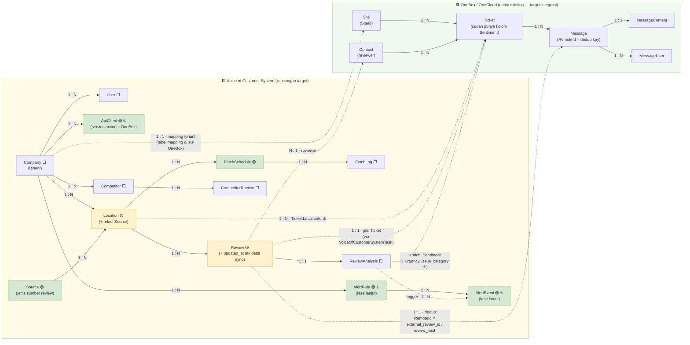

> ⚠️ **SUPERSEDED oleh `decisions/ADR-0001-ownership-inversion.md` (2026-07-21).**
> **JANGAN dipakai sebagai acuan kerja baru.** ERD di bawah menampilkan VoC memiliki `Location`, `Competitor`, `Company`, `User` — itu **sudah tidak berlaku**. Semua master data pindah ke OneBox; VoC hanya crawler engine headless. Disimpan sebagai histori.

# Voice of Customer System — ERD Rancangan Target + Integrasi OneBox (Draft v2)

> **Ini BUKAN potret schema existing.** Ini **rancangan pengembangan**: entity existing VoC dipertahankan sebagai fondasi, ditambah entity usulan baru, **dan disandingkan dengan entity OneBox** yang jadi tujuan integrasinya — supaya jalur datanya tergambar utuh lintas dua sistem.
> **Baseline existing VoC** (diverifikasi dari `app/db/models.py` ✅): Company, User, Location, Review, ReviewAnalysis, FetchLog, Competitor, CompetitorReview.
> **Entity OneBox** (referensi, bukan milik VoC — sumber: [onebox_system/erd.md](../onebox_system/erd.md) + verifikasi `app/models/Ticket.php`): Site, Contact, Ticket, Message, MessageContent, MessageUser.
> **Kardinalitas:** ditulis di tiap garis (`1 : N`, `1 : 1`, `N : 1`). Garis putus-putus lintas sistem = **mapping logis** (dieksekusi `VoiceOfCustomerSystemTask`), bukan foreign key fisik.
> **Legend status:** ⬜ existing · 🟡 existing + penyesuaian · 🟢 baru (usulan) · ⚠️ menunggu keputusan lead/Codex

---

## Diagram

> **Catatan keterbacaan:** relasi `Company 1:N Review` dan `Company 1:N FetchLog` (FK nyata di schema) tidak digambar supaya diagram tidak silang-menyilang — semua entity VoC ber-`company_id`. Prinsip yang sama seperti catatan `site_id` di ERD Onebox.

---

## Kardinalitas Lintas Sistem (inti integrasi)

| VoC | Kardinalitas | OneBox | Makna | Status |
|---|---|---|---|---|
| `Company` | **1 : 1** | `Site` | satu tenant VoC = satu site OneBox; tabel mapping disimpan **di sisi OneBox** | keputusan arsitektur |
| `Review` | **1 : 1** | `Ticket` | tiap review jadi tepat satu Ticket (idempotent — rerun tidak duplikat) | pola SonarTask |
| `Review` | **1 : 1** | `Message` | isi review masuk Message; `Message.RemoteId` = `external_review_id`/`review_hash` → **kunci dedup** | pola SonarTask |
| `Review` (reviewer) | **N : 1** | `Contact` | banyak review dari reviewer yang sama menunjuk satu Contact | find-or-create |
| `Location` | **1 : N** | `Ticket` | satu lokasi RS menghasilkan banyak ticket review (`Ticket.LocationId`) | ⚠️ validasi model Location OneBox |
| `ReviewAnalysis` | **enrich** | `Ticket` | `sentiment` → `Ticket.Sentiment` (sudah ada); `urgency`/`issue_category`/`summary`/`recommended_action` → ⚠️ kolom baru vs `Reference`/`Data` | keputusan lead |

**Kenapa garis lintas sistem putus-putus:** itu bukan foreign key — dua sistem punya DB masing-masing. Relasinya **logis**, dieksekusi oleh `VoiceOfCustomerSystemTask` saat sync (pull → dedup → map → insert). Kalau VoC System mati, data di OneBox tetap utuh.

---

## Penjelasan per Entity — sisi VoC

### Dipertahankan ⬜

| Entity | Peran |
|--------|-------|
| `Company` | **Tenant** — akar semua data. Mirror `Site`/`SiteId` OneBox |
| `User` | Akun pengguna internal VoC (JWT login) — tetap untuk FE/admin |
| `FetchLog` | Riwayat tiap operasi fetch — jadi *child* dari FetchSchedule di rancangan baru |
| `ReviewAnalysis` | Hasil analisa AI per review (1:1 dengan Review) |
| `Competitor` / `CompetitorReview` | Pemantauan kompetitor — tidak disentuh integrasi fase ini |

### Disesuaikan 🟡

| Entity | Penyesuaian | Alasan |
|--------|-------------|--------|
| `Review` | `updated_at` terindeks + index unik `(company_id, review_hash)` | delta sync `updated_since` + dedup key stabil untuk `Message.RemoteId` |
| `Location` | `external_place_id` via relasi ke `Source` | siap multi-sumber tanpa rombak struktur |

### Baru 🟢

| Entity | Fungsi | Pola Onebox yang ditiru | Status |
|--------|--------|--------------------------|--------|
| `ApiClient` | Credential **service-to-service** untuk OneBox (per Company) | `Connection` | ⚠️ nunggu keputusan auth |
| `Source` | Jenis sumber review (Google Maps → nanti app store, sosmed) | `Media`/`Provider` | usulan |
| `FetchSchedule` | Jadwal crawl per lokasi; `FetchLog` = riwayat eksekusinya | pola scheduler/task | usulan |
| `AlertRule` / `AlertEvent` | Trigger review urgent/patient-safety → notifikasi | `Trigger` → `NotificationEvent` → `Notification` | ⚠️ fase lanjut |

## Penjelasan per Entity — sisi OneBox (referensi)

> Entity di bawah **bukan milik VoC** dan **tidak diubah** oleh rancangan ini — digambar supaya jalur integrasi kelihatan. Detail lengkap: [onebox_system/erd.md](../onebox_system/erd.md).

| Entity | Peran dalam integrasi |
|--------|------------------------|
| `Site` | Tenant OneBox — target mapping `Company` |
| `Ticket` | **Tempat review mendarat** (keputusan lead: "data di-pull ke table Ticket") — sudah punya kolom `Sentiment` ✅ |
| `Message` + `MessageContent` | Isi teks review; `RemoteId` dipakai sebagai kunci dedup (pola SonarTask) |
| `MessageUser` | Peran pengirim pesan (reviewer sebagai author) |
| `Contact` | Identitas reviewer (find-or-create saat sync) |

### Sengaja TIDAK dibuat di VoC System

| Kandidat | Kenapa tidak |
|----------|--------------|
| Tabel mapping `Company`/`Location` ↔ `SiteId` | Disimpan **di sisi OneBox** (per two_agents_workflow) — VoC cukup expose `location_id` |
| Checkpoint/antrian sync | Pull model: state sync dipegang OneBox; VoC cukup sediakan `updated_since` |
| Normalisasi `keywords` jadi entity | JSON di `ReviewAnalysis` masih cukup — hindari over-engineering |

---

## Prinsip rancangan

1. **Additive, bukan destruktif** — semua entity existing dipertahankan; migrasi aman.
2. **Tenant-first** — entity baru ngakar ke `Company`; lintas sistem di-scope `Company↔Site` 1:1.
3. **Pintu integrasi tetap satu** — REST API (Proses 3 di [dfd.md](dfd.md)); garis putus-putus di diagram semuanya lewat pintu itu.
4. **Tiru pola yang terbukti** — `Source`↔`Media/Provider`, `ApiClient`↔`Connection`, `AlertRule/AlertEvent`↔`Trigger/NotificationEvent`, dedup `RemoteId`↔SonarTask.
