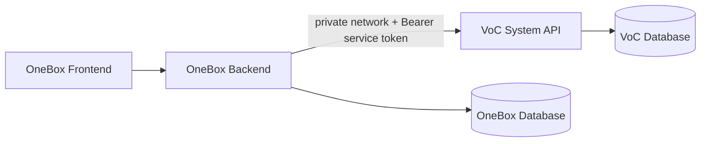

# Network, WireGuard, dan CORS VoC System x OneBox

Panduan ini menjelaskan solusi konfigurasi dua sisi untuk integrasi **VoC System** sebagai API provider dan **OneBox** sebagai consumer. Fokusnya membedakan konektivitas jaringan, authentication, alur pull data, dan CORS.

## 1. Keputusan arsitektur

Gunakan pola berikut untuk MVP:




OneBox backend melakukan pull ke VoC secara server-to-server, lalu mapping dan menyimpan hasilnya ke Ticket, Message, dan MessageContent. Frontend OneBox membaca data melalui backend OneBox.

Dengan pola ini, CORS tidak diperlukan untuk request pull karena request berasal dari backend, bukan browser. Yang wajib adalah route jaringan, firewall, port, URL, dan authentication.

## 2. Arti IP WG

WG biasanya berarti **WireGuard**, yaitu VPN atau network overlay. IP 10.13.13.90 kemungkinan alamat private pada interface WireGuard server VoC atau gateway menuju VoC.

IP tersebut tidak otomatis berarti OneBox dapat mengakses VoC. Semua syarat berikut harus terpenuhi:

- server VoC memiliki interface WireGuard dengan IP 10.13.13.90;
- server OneBox terhubung ke WireGuard yang sama atau punya route ke jaringan WireGuard;
- firewall mengizinkan OneBox menuju 10.13.13.90:8000;
- Docker atau reverse proxy meneruskan port API;
- VoC listen pada 0.0.0.0:8000, bukan hanya 127.0.0.1.

**IP WG adalah jalur private/VPN, bukan konfigurasi CORS.**

## 3. Bedakan network, auth, dan CORS

| Masalah | Gejala | Perbaikan |
|---|---|---|
| Route atau firewall | timeout, connection refused, no route to host | WireGuard, routing, firewall, port |
| Authentication | HTTP 401 atau 403 | service token atau permission |
| Browser cross-origin | browser memblokir request | CORS allowlist di API |
| API contract | HTTP 404, 405, payload salah | base path dan endpoint contract |

CORS hanya berlaku pada browser. Curl, PHP client, scheduler, dan request backend-to-backend tidak diblokir CORS.

## 4. Bedakan tiga alamat

| Nilai | Contoh | Dipakai untuk |
|---|---|---|
| VoC API base URL | http://10.13.13.90:8000 | OneBox backend memanggil VoC |
| VoC endpoint | http://10.13.13.90:8000/api/reviews | request pull |
| Browser FE origin | https://onebox.internal | CORS_ALLOWED_ORIGINS |

Origin browser hanya scheme + host + port. Jangan menulis path API ke CORS.

- Benar: https://onebox.internal
- Benar: http://10.13.13.90:3000
- Salah: https://onebox.internal/dashboard
- Salah: http://10.13.13.90:8000/api/reviews

## 5. Konfigurasi sisi VoC System

### 5.1 CORS_ALLOWED_ORIGINS

VoC membaca CORS_ALLOWED_ORIGINS dari .env dan menerapkannya melalui FastAPI CORSMiddleware.

Development:

```dotenv
CORS_ALLOWED_ORIGINS=http://localhost:3000,http://127.0.0.1:3000
```


Production jika FE OneBox memanggil VoC langsung dari browser:

```dotenv
CORS_ALLOWED_ORIGINS=https://onebox.internal
```


Beberapa origin resmi:

```dotenv
CORS_ALLOWED_ORIGINS=https://onebox.internal,https://onebox-staging.internal
```


Jangan memakai wildcard. Aplikasi menggunakan allow_credentials=True, sehingga allowlist eksplisit wajib.

### 5.2 Apakah IP WG dimasukkan ke CORS?

Tidak secara otomatis.

- Jika 10.13.13.90 adalah alamat API VoC dan FE berasal dari https://onebox.internal, yang dimasukkan adalah https://onebox.internal.
- Jika halaman FE benar-benar disajikan dari http://10.13.13.90:3000, origin itulah yang boleh dimasukkan.
- Jika OneBox backend melakukan pull, IP WG hanya dipakai sebagai VOC_API_BASE_URL. Tidak perlu masuk CORS.

### 5.3 Reload konfigurasi Docker

Perubahan .env adalah runtime config. Rebuild image tidak wajib, tetapi container perlu dibuat ulang:

```bash
cd ~/herminaCrawler
nano .env
docker compose up -d --force-recreate api
docker compose ps
docker compose logs --tail=100 api
```


Verifikasi dari server VoC:

```bash
curl -i http://127.0.0.1:8000/api/health
curl -i http://10.13.13.90:8000/api/health
```


## 6. Konfigurasi sisi OneBox

### 6.1 Config untuk pull backend

Nama key final mengikuti convention config OneBox. Contract yang direkomendasikan:

```dotenv
VOC_API_BASE_URL=http://10.13.13.90:8000
VOC_API_TOKEN=<service-token-per-environment>
VOC_API_TIMEOUT_SECONDS=30
VOC_API_PAGE_SIZE=100
VOC_API_ENABLED=false
```


- VOC_API_BASE_URL harus dapat dijangkau dari host atau container OneBox.
- VOC_API_TOKEN disimpan di secret/config per environment dan tidak boleh di-commit.
- VOC_API_ENABLED=false saat deployment awal, lalu true setelah smoke test.
- Jika tersedia, gunakan HTTPS private hostname sebagai pengganti raw IP.

Request client OneBox:

```text
GET {VOC_API_BASE_URL}/api/reviews
Authorization: Bearer {VOC_API_TOKEN}
Accept: application/json
X-Request-ID: {generated-request-id}
```


Contoh pagination:

```text
/api/reviews?page_size=100&cursor=<opaque-cursor>
```


OneBox menyimpan cursor setelah satu batch berhasil di-ingest. Jika batch gagal, request diulang dan dedup SiteId + review_hash mencegah Ticket ganda.

### 6.2 Apakah OneBox perlu CORS untuk memanggil VoC?

Untuk pola backend OneBox -> VoC:

- OneBox tidak perlu CORS untuk memanggil VoC.
- VoC tidak perlu mengizinkan IP backend OneBox di CORS.
- Yang dibutuhkan adalah route WireGuard, firewall, base URL, dan service token.

Untuk pola browser FE OneBox -> VoC langsung:

- VoC harus mengizinkan origin FE OneBox melalui CORS_ALLOWED_ORIGINS.
- OneBox backend tetap mengatur CORS miliknya untuk FE OneBox jika request FE -> OneBox backend lintas origin.
- Origin adalah alamat halaman FE, bukan alamat API tujuan.

Contoh konseptual CORS milik OneBox:

```dotenv
ONEBOX_CORS_ALLOWED_ORIGINS=https://onebox.internal
```


Nama key final harus mengikuti config OneBox. Ini berbeda dari CORS_ALLOWED_ORIGINS milik VoC.

## 7. Uji konektivitas dari OneBox

Uji dari host atau container OneBox yang menjalankan PHP/Swoole, bukan hanya dari laptop atau server VoC.

### 7.1 Uji route dan port

```bash
ping -c 3 10.13.13.90
nc -vz -w 5 10.13.13.90 8000
```


Ping boleh gagal karena ICMP diblokir. Hasil nc dan curl lebih penting.

Jika nc belum tersedia:

```bash
timeout 5 bash -c '</dev/tcp/10.13.13.90/8000' && echo OPEN || echo CLOSED
```


Jika host berhasil tetapi container gagal, cek network container. Test harus dijalankan pada container proses yang sebenarnya.

### 7.2 Uji HTTP dan auth

```bash
curl -i --connect-timeout 5 http://10.13.13.90:8000/api/health
curl -i --connect-timeout 5 http://10.13.13.90:8000/api/docs
curl -i --connect-timeout 5 \
  -H 'Authorization: Bearer <SERVICE_TOKEN>' \
  'http://10.13.13.90:8000/api/reviews?page_size=1'
```


Interpretasi:

| Hasil | Arti |
|---|---|
| 200 health | network dan service dasar tersedia |
| 401 atau 403 reviews | network tembus, token/permission bermasalah |
| 404 | base path atau endpoint salah |
| Connection refused | host tercapai, port/service tidak menerima |
| Connection timed out | firewall, route, VPN, atau security group |
| No route to host | route WireGuard/jaringan belum tersedia |
| HTTP berhasil tetapi browser error CORS | allowlist origin browser bermasalah |

## 8. Uji CORS

Curl biasa tidak menguji CORS. Gunakan preflight dengan origin FE OneBox sebenarnya:

```bash
curl -i -X OPTIONS \
  http://10.13.13.90:8000/api/reviews \
  -H 'Origin: https://onebox.internal' \
  -H 'Access-Control-Request-Method: GET' \
  -H 'Access-Control-Request-Headers: authorization,content-type'
```


Response yang diharapkan:

```text
access-control-allow-origin: https://onebox.internal
access-control-allow-credentials: true
```


Jika header tidak ada, cek origin persis, tidak ada path/trailing slash, container sudah force-recreate, request menuju container terbaru, dan reverse proxy tidak menghapus header.

## 9. Pertanyaan untuk Infra OneBox

```text
1. Apakah 10.13.13.90 IP WireGuard server VoC, atau IP gateway/peer?
2. Apakah host dan container OneBox memiliki route ke 10.13.13.90?
3. Apakah TCP port 8000 dari OneBox ke 10.13.13.90 diizinkan?
4. Apakah OneBox pull dari backend, atau FE browser memanggil VoC langsung?
5. Apa hostname atau HTTPS URL final yang harus dipakai?
6. Auth final apa: service token, API key, atau JWT service account?
7. Jika browser direct call, apa origin FE OneBox yang masuk allowlist VoC?
8. Apakah ada IP allowlist tambahan selain route WireGuard?
```


## 10. Ringkasan nilai config

### VoC System

```text
Listen address:        0.0.0.0:8000
API base URL internal: http://10.13.13.90:8000
Runtime env file:      .env
CORS key:              CORS_ALLOWED_ORIGINS
CORS value:            <origin FE OneBox jika browser direct call>
Auth:                  Bearer service token/JWT sesuai contract final
```


### OneBox backend

```text
VOC_API_BASE_URL:      http://10.13.13.90:8000
VOC_API_TOKEN:         <secret per environment>
VOC_API_TIMEOUT:       30
VOC_API_PAGE_SIZE:     100
VOC_API_ENABLED:       false lalu true setelah smoke test
```


### OneBox frontend

Untuk MVP, FE cukup memanggil backend OneBox. Jika harus direct call ke VoC:

```text
API URL FE direct:      http://10.13.13.90:8000/api
Browser origin:         https://onebox.internal
VoC CORS allowlist:     https://onebox.internal
```


Jangan memasukkan URL API sebagai origin hanya karena itu URL tujuan request.

## 11. Rollout

1. Infra memastikan WireGuard route dan firewall OneBox -> 10.13.13.90:8000.
2. Jalankan curl health dari host dan container OneBox.
3. Konfigurasi VOC_API_BASE_URL di OneBox.
4. Simpan service credential pada secret/config per environment.
5. Jalankan authenticated request ke /api/reviews.
6. Jalankan contract test pagination, cursor, review_hash, dan rerun dedup.
7. Aktifkan task pull OneBox setelah smoke test lulus.
8. Tambahkan CORS_ALLOWED_ORIGINS VoC hanya jika browser FE direct call.
9. Setelah endpoint stabil, pindahkan raw IP ke HTTPS private hostname.

## 12. Kesimpulan

- 10.13.13.90 kemungkinan IP WireGuard/private network, bukan solusi CORS.
- Pertanyaan pertama: apakah OneBox server/container bisa connect ke 10.13.13.90:8000?
- Untuk OneBox pull, CORS tidak diperlukan. Fokus pada route, firewall, base URL, dan service auth.
- CORS_ALLOWED_ORIGINS VoC berisi origin browser FE yang sebenarnya, bukan IP API otomatis.
- OneBox memasang VOC_API_BASE_URL dan credential service-to-service di config per environment.
- Jangan membuka port ke internet publik. Gunakan WireGuard/private route, firewall allowlist, authentication, dan HTTPS.
