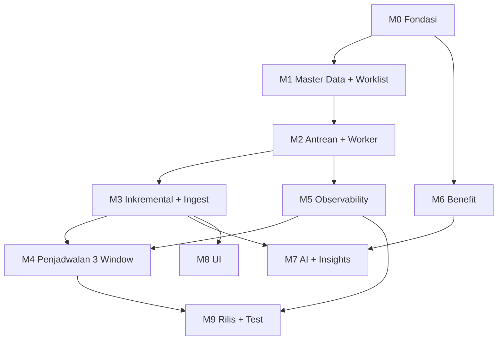

# VoC × OneBox — Tasklist Development (per Modul)

> **Dibuat:** 2026-07-24 · **Otoritas:** [ADR-0001](../decisions/ADR-0001-ownership-inversion.md) · [ADR-0002](../decisions/ADR-0002-ai-execution-split.md) · [ADR-0003](../decisions/ADR-0003-crawl-execution-pull-queue.md)
> **Menggantikan sebagai peta kerja utama:** urutan fase di `implementation-plan-onebox/00_INDEX.md` dan `implementation-plan-crawler-system/00_INDEX.md`.
> Dokumen RI-xx & VOC-CS-xx **tetap berlaku sebagai detail teknis** — tasklist ini yang menentukan urutan & status.

---

## Cara pakai (baca dulu — ini yang bikin AI & dev lain nyambung)

1. **ID tidak pernah dinomori ulang.** Kalau task batal → status `superseded`, bukan dihapus.
2. **Tiap task wajib punya 4 hal:** Owner · Prasyarat · Definition of Done · Cara verifikasi. Tanpa itu, task belum siap dikerjakan.
3. **Tandai setiap klaim** `[verified]` / `[assumption]` / `[blocked]`. Jangan tulis "sudah jalan" tanpa bukti.
4. **ADR menang** atas dokumen mana pun. Kalau tasklist bentrok dengan ADR → ADR benar, tasklist yang salah, perbaiki tasklist.
5. **Selesai = observable.** Bukti minimum: commit/PR, perintah test, curl tersanitasi (tanpa token), hasil aktual.
6. **API gap → handoff**, jangan ditambal di sisi yang salah. OneBox tak boleh menambal kekurangan VoC, begitu juga sebaliknya.

### Legend

| Kolom | Nilai |
|---|---|
| **Owner** | `OB` = OneBox (PHP/Phalcon, agen Claude) · `VC` = VoC Crawler (Python/FastAPI, Codex) · `OPS` = manusia/senior dev |
| **Status** | `todo` · `wip` · `done` · `blocked` · `superseded` |
| **MD** | estimasi man-day (coding + test + self-review + dok) |

---

## Prasyarat global (harus benar SEBELUM task apa pun jalan)

| # | Prasyarat | Status | Catatan |
|---|---|---|---|
| P1 | Docker + stack `dev_DNGO19-3346` hidup; Traefik publish :80/:443 | `done` [verified] | webapp di balik Traefik, listen :80 internal |
| P2 | Base URL OneBox dev = `https://localhost/feature/DNGO19-3346` (pakai `curl -k`) | `done` [verified] | alternatif: header `Host: DNGO19-3346.ciptadrasoft.net` |
| P3 | Akun login OneBox dev valid | `done` [verified] | `voc.dev@onebox.local` / siteId **169**. `test@gmail.com` **tidak valid** |
| P4 | VoC API hidup + service token untuk OneBox | `done` [verified] | spec di `/api/openapi.json`, **bukan** `/openapi.json` |
| P5 | Jaringan VoC → OneBox terbuka (dua arah, bukan cuma OneBox → VoC) | `todo` [assumption] | prasyarat mutlak M1-05 |
| P6 | Seeding DB dev seragam antar dev | `blocked` | dieskalasi ke senior dev — jangan diutak-atik dulu |
| P7 | ADR-0001/0002/0003 diratifikasi Pak Agung | `todo` | teknis boleh jalan pakai default; ratifikasi mengunci |

> **CORS tidak termasuk prasyarat.** CORS itu mekanisme browser; panggilan server-to-server (httpx/curl) mengabaikannya. Yang jadi gerbang adalah P5 + auth.

---

## M0 — Fondasi & Tata Kelola

**Tujuan:** keputusan terkunci, dokumen tidak saling bertentangan, dev baru bisa onboard.
**Prasyarat modul:** —

| ID | Task | Owner | Prasyarat | MD | Status |
|---|---|---|---|---|---|
| M0-01 | ADR-0001 (inversi kepemilikan) | OB | — | 1 | `done` |
| M0-02 | ADR-0002 (split AI) | OB | M0-01 | 0.5 | `done` |
| M0-03 | ADR-0003 (pull worklist + antrean crawl) | OB | M0-01 | 1 | `done` |
| M0-04 | Tandai dokumen basi + amandemen (MUST_READ, RI-08, ADR-0001) | OB | M0-03 | 0.5 | `done` |
| M0-05 | Ratifikasi 3 ADR ke Pak Agung (satu paket) | OPS | M0-03 | 0.5 | `todo` |
| M0-06 | Seeding DB dev + akun dev lintas mesin | OPS | — | 2 | `blocked` |
| M0-07 | Perbaiki `getUserAllRole` (SQL `IN ()` saat user tanpa role) | OPS | izin senior dev | 0.5 | `blocked` |
| M0-08 | Runbook onboarding dev baru (setup → smoke test) | OB | M1-05 | 1 | `todo` |

---

## M1 — Master Data & Provisioning *(ADR-0003 increment a)*

**Tujuan:** user cuma menyentuh OneBox; simpan instan; VoC menarik target sendiri.
**Prasyarat modul:** P1–P4

| ID | Task | Owner | Prasyarat | MD | Status |
|---|---|---|---|---|---|
| M1-01 | CRUD Lokasi di OneBox (form, simpan, toggle, hapus) | OB | — | 3 | `done` |
| M1-02 | CRUD Kompetitor di OneBox (pola sama; `StatusId=CNS3` agar tak disapu penjadwal) | OB | M1-01 | 3 | `done` |
| M1-03 | Endpoint worklist `GET /api/VocWorklist` (JWT, tenant dari `sid`) | OB | P3 | 1 | `done` [verified] |
| M1-04 | Lepas push sinkron dari jalur simpan (lokasi + kompetitor) | OB | M1-03 | 0.5 | `done` |
| M1-05 | **Consumer worklist di VoC** (client outbound, sync ke cache, rekonsiliasi) | VC | M1-03, P5 | 4 | `wip` |
| M1-06 | Hapus jembatan transisi OneBox (push di tombol resync & toggle) | OB | M1-05 terbukti | 0.5 | `todo` |
| M1-07 | Jadikan endpoint tulis Location/Competitor VoC read-only bagi manusia | VC | M1-05 | 1 | `todo` |
| M1-08 | Perbaiki `StatusId` Hermina Depok (conn 1039 = `CNS2`, tak ikut penjadwal) | OPS | — | 0.1 | `todo` [verified] |

**DoD modul:** tambah lokasi di OneBox → muncul di VoC tanpa langkah manual; hapus/nonaktif → target ditandai nonaktif di VoC; tidak ada push sinkron tersisa di jalur simpan.

---

## M2 — Eksekusi Crawl: Antrean + Worker *(increment b)*

**Tujuan:** crawl tidak lagi lewat request blocking; beban Selenium terkendali.
**Prasyarat modul:** M1-05

| ID | Task | Owner | Prasyarat | MD | Status |
|---|---|---|---|---|---|
| M2-01 | Tabel antrean crawl job (`pending/claimed/done/failed`, attempts, next_retry_at, locked_by) | VC | M1-05 | 2 | `todo` |
| M2-02 | Worker penguras antrean, klaim atomik `SELECT … FOR UPDATE SKIP LOCKED` | VC | M2-01 | 3 | `todo` |
| M2-03 | Endpoint enqueue non-blocking `POST /api/integration/v1/crawl-jobs` → balas `batch_id` | VC | M2-01 | 2 | `todo` |
| M2-04 | Retry sadar-jenis-error + backoff & jitter (429 backoff, 404 no-retry, timeout retry singkat) | VC | M2-02 | 2 | `todo` |
| M2-05 | Rate limit per target + stagger dalam window (jangan serempak) | VC | M2-02 | 1.5 | `todo` |
| M2-06 | Backpressure: tolak job baru saat CPU/RAM di atas ambang | VC | M2-02 | 1 | `todo` |
| M2-07 | Endpoint status batch `GET /api/integration/v1/crawl-jobs/{batch_id}` | VC | M2-03 | 1 | `todo` |

**DoD modul:** trigger crawl balas < 1 detik (tidak menunggu Selenium); job gagal di-retry sesuai jenis error; antrean bisa diamati kedalamannya.

> **Jangan** pasang Redis/Celery dulu. Postgres `SKIP LOCKED` cukup untuk skala pilot (ADR-0003 §Model data, selaras RI-08 §10).

---

## M3 — Crawl Inkremental & Ingest Review *(increment c)*

**Tujuan:** window harian selesai dalam detik; review lama tersinkron tanpa duplikat.
**Prasyarat modul:** M2-02

| ID | Task | Owner | Prasyarat | MD | Status |
|---|---|---|---|---|---|
| M3-01 | Crawl cursor per target (scrape terbaru-dulu, **stop saat menyentuh yang sudah dimiliki**) | VC | M2-02 | 3 | `todo` |
| M3-02 | Tetapkan kunci idempotency review (id stabil Google vs hash `author+tanggal+teks`) | VC | — | 1 | `todo` [assumption] |
| M3-03 | Delta pull OneBox pakai `checkpoint_cursor` (kontrak `/integration/v1/reviews` sudah ada) | OB | M3-01 | 2 | `todo` |
| M3-04 | **Backfill bertarget** per lokasi baru: `?location_id=..&updated_since=<jauh>` sebelum gabung ke delta | OB | M3-03 | 2 | `todo` |
| M3-05 | Rekonsiliasi lokasi lama yang sudah di-crawl VoC tapi belum punya Ticket (kasus Bekasi) | OB | M3-04 | 1 | `todo` |
| M3-06 | **[API gap]** VoC ekspos `competitor_reviews` — belum ada endpoint sama sekali | VC | M2-02 | 3 | `blocked` [verified] |
| M3-07 | Konsumsi review kompetitor di OneBox (jangan jadi Ticket) | OB | M3-06 | 2 | `blocked` |

**DoD modul:** window harian menarik hanya review baru; re-sync tidak pernah bikin Ticket dobel (counter `deduped` naik, `inserted` tidak); lokasi baru yang sudah punya histori di VoC ter-backfill penuh.

> **Jebakan yang sudah teridentifikasi:** kalau checkpoint tenant sudah maju lalu ditambah lokasi baru yang review-nya bertanggal lama, delta murni **melewatkannya**. Karena itu M3-04 wajib jalan sebelum lokasi baru masuk aliran delta.

---

## M4 — Penjadwalan 3 Window

**Tujuan:** data segar sebelum jam kerja, tanpa user menunggu.
**Prasyarat modul:** M2-03, M5-01 *(jangan menjadwalkan job yang belum tahan banting)*

| ID | Task | Owner | Prasyarat | MD | Status |
|---|---|---|---|---|---|
| M4-01 | Tabel schedule occurrence, unique `(site_id, local_date, slot)` | OB | — | 1.5 | `todo` |
| M4-02 | `planned_at` random ter-persist per slot (pagi 05–07, siang 11–13, malam 21–23), timezone site | OB | M4-01 | 1.5 | `todo` |
| M4-03 | Ubah trigger: fetch sinkron → **kick non-blocking** ke M2-03 lalu delta pull | OB | M2-03, M3-03 | 2 | `todo` |
| M4-04 | Lock no-overlap + idempotency key `site:date:slot` | OB | M4-02 | 1 | `todo` |
| M4-05 | UI histori run (planned/actual/status/counters) + tombol Run now | OB | M4-04 | 2 | `todo` |

**DoD modul:** satu site = tepat 3 occurrence/hari; restart tidak mengubah `planned_at`; dua trigger bersamaan → hanya satu run.

> Detail lengkap tetap di [RI-08](implementation-plan-onebox/RI-08_scheduler-delta.md). **Owner scheduler tunggal = OneBox.** Jangan bikin scheduler kedua di VoC.

---

## M5 — Observability & Reliability *(increment d)*

**Tujuan:** kegagalan terlihat sebelum user yang melapor.
**Prasyarat modul:** M2-02

| ID | Task | Owner | Prasyarat | MD | Status |
|---|---|---|---|---|---|
| M5-01 | Error handling + ringkasan run (`fetched/inserted/deduped/failed`) | OB | — | 2 | `todo` |
| M5-02 | Freshness per target: `last_crawled_at`, `last_success_at`, `consecutive_failures` | VC | M3-01 | 1.5 | `todo` |
| M5-03 | Badge UI "Terakhir di-crawl HH:MM" menggantikan status provisioning | OB | M5-02 | 1 | `todo` |
| M5-04 | Alarm: target bolos window / antrean menumpuk / error-rate > 10% | OB | M5-01 | 1.5 | `todo` |
| M5-05 | Log higienis: tidak pernah memuat token, cursor utuh, atau teks review penuh | OB+VC | — | 1 | `todo` |

---

## M6 — Entitlement / Benefit

**Tujuan:** kuota & komersial terpusat di OneBox.
**Prasyarat modul:** M0-06 beres *(butuh site & benefit ter-seed konsisten)*

| ID | Task | Owner | Prasyarat | MD | Status |
|---|---|---|---|---|---|
| M6-01 | Perbaikan cacat `BenefitService` (site lookup, `SiteBenefit.Amount`, null guard) | OB | — | 1 | `done` |
| M6-02 | Registrasi kode benefit `VOC_SCRAPE`, `VOC_AI`, `VOC_COMPETITOR` | OB | M0-06 | 1 | `todo` |
| M6-03 | Pasang `verifyBenefit` (kuota **jumlah panggilan**) di jalur crawl | OB | M6-02 | 1 | `todo` |
| M6-04 | Pasang `addUsage` (kuota **nilai**, mis. token) di jalur analisa | OB | M6-02, M7-03 | 1 | `todo` |

> ⚠️ **Jebakan terdokumentasi:** `verifyBenefit()` bukan pemeriksaan murni — ia menaikkan `SiteBenefit.Quantity`. Memasangkannya dengan `addUsage()` untuk satuan yang sama = **hitung dobel**. Pisahkan: `verifyBenefit` untuk jumlah panggilan, `addUsage` untuk nilai.

---

## M7 — AI Analysis & Insights *(ADR-0002, increment e)*

**Tujuan:** analisa jalan di background, bukan di jalur baca user.
**Prasyarat modul:** M3-01, M6-02

| ID | Task | Owner | Prasyarat | MD | Status |
|---|---|---|---|---|---|
| M7-01 | Antrean analisa terpisah, dipicu event "review baru" | VC | M2-01 | 2 | `todo` |
| M7-02 | Kontrak parameter AI: `ai_enabled`, `model`, `prompt_version`, `threshold` | OB+VC | — | 1 | `todo` |
| M7-03 | VoC mengembalikan `tokens_used` (+ `analysis_skipped_count`) | VC | M7-02 | 1.5 | `todo` |
| M7-04 | Simpan parameter AI di `Connection.Options`, kirim lewat worklist | OB | M7-02 | 1 | `todo` |
| M7-05 | Klasifikasi rule-first (`Service\Ruling`) sebelum AI — hemat token | OB | — | 2 | `todo` |
| M7-06 | Halaman Insights (cakupan masih dikaji ulang) | OB | M7-01 | 3 | `todo` |

---

## M8 — UI & Pengalaman Pengguna (OneBox)

**Tujuan:** modul non-negotiable tampil utuh dan konsisten.
**Prasyarat modul:** M3-03 *(butuh data nyata)*

| ID | Task | Owner | Prasyarat | MD | Status |
|---|---|---|---|---|---|
| M8-01 | List review + filter/paging di SQL (bukan di browser) | OB | — | 4 | `done` |
| M8-02 | Detail review | OB | M8-01 | 3 | `todo` |
| M8-03 | Dashboard VoC | OB | M8-01 | 4 | `done` |
| M8-04 | Halaman Location & Competitor management | OB | M1-01, M1-02 | — | `done` |
| M8-05 | Reports | OB | M8-01 | 4 | `todo` |
| M8-06 | Aksi kelola review: assign / resolve / note | OB | M8-02 | 4 | `todo` |
| M8-07 | Menu + role/permission | OB | M0-07 | 2 | `todo` |

> **Guardrail wajib:** teks review = **konten publik tak terpercaya** → selalu escape di Volt. Tanpa kecuali.

---

## M9 — Rilis, Test, Runbook

**Prasyarat modul:** M1–M5 selesai

| ID | Task | Owner | Prasyarat | MD | Status |
|---|---|---|---|---|---|
| M9-01 | Contract test OneBox ⇄ VoC (fixture deterministik) | OB+VC | M3-03 | 3 | `todo` |
| M9-02 | E2E: buat lokasi → crawl → review jadi Ticket | OB+VC | M4-03 | 3 | `todo` |
| M9-03 | Failure drill: VoC mati, OneBox mati, token kadaluwarsa, antrean penuh | OB+VC | M5-04 | 2 | `todo` |
| M9-04 | Runbook deploy + rollback (flag disable, jangan hapus checkpoint) | OPS | M9-03 | 2 | `todo` |

---

## Peta dependensi

**Jalur kritis:** `M1-05 → M2-02 → M3-01 → M4-03`. Semua yang lain bisa paralel.

---

## Guardrail lintas-task (berlaku selalu)

1. Semua query/insert OneBox **scoped `SiteId`** — tanpa kecuali. Semua query VoC scoped `company_id` **dari service identity**, bukan dari request.
2. **Jangan** commit `.env*`, `app/config/development.php`, `app/config/local.php`, atau credential apa pun.
3. **Jangan** pindahkan logic Selenium/crawling ke OneBox.
4. **Jangan** bikin migration tanpa persetujuan.
5. Teks review = konten publik tak terpercaya → **escape di view**.
6. Jangan log token, secret, raw payload, cursor utuh, atau teks review penuh.
7. Datetime kontrak = **UTC ISO 8601**; tampilkan pakai timezone site.
8. Checkpoint consumer maju **hanya** setelah seluruh page sukses.

---

## Pemetaan ke dokumen lama

| Dokumen lama | Status |
|---|---|
| `RI-01, RI-03, RI-04, RI-05, RI-07, RI-09..RI-17` | **berlaku** sebagai detail teknis |
| `RI-02` (D2, D6) | `superseded` oleh ADR-0001 |
| `RI-06` tenant-mapping | `superseded` oleh ADR-0001 (arah mapping terbalik) |
| `RI-08` scheduler | **berlaku**, di-amandemen ADR-0003 (trigger jadi non-blocking) |
| `VOC-CS-01..07` | **berlaku**; CS-02/CS-05 diperluas M2/M3/M5 |
| `crawler_system/erd.md`, `dfd.md`, `architecture_diagram.md` | `superseded` oleh ADR-0001 |
