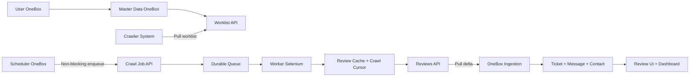

# Voice of Customer System - Stakeholder Overview

> Status: Draft untuk stakeholder review
> Tanggal: 23 Juli 2026
> Tujuan: Menjelaskan sistem Voice of Customer pada level bisnis, operasional, dan arsitektur konseptual.

## 1. Executive Summary

Voice of Customer System adalah kapabilitas OneBox untuk mengumpulkan, memahami, dan menindaklanjuti suara pelanggan dari review publik. OneBox menjadi pusat pengelolaan data, workflow, dashboard, jadwal, dan tindak lanjut. Crawler System menjadi service pendukung tanpa UI produksi yang menjalankan pekerjaan crawling dan analisis secara background.

Pengguna cukup bekerja dari OneBox. Lokasi dan kompetitor disimpan di OneBox, lalu Crawler System mengambil daftar target aktif melalui worklist. OneBox menentukan kapan proses berjalan, sedangkan Crawler System mengerjakan crawling secara asynchronous. Hasil review kemudian ditarik kembali oleh OneBox, disimpan sebagai Ticket, dan ditampilkan untuk monitoring serta tindak lanjut operasional.

## 2. Business Context

Review pelanggan berisi informasi penting mengenai kualitas layanan, pengalaman pasien, masalah operasional, dan potensi risiko reputasi. Namun, review dari berbagai lokasi sulit dipantau secara rutin apabila prosesnya masih manual.

Tanpa sistem terpusat:

- review baru dapat terlambat diketahui;
- keluhan dengan urgensi tinggi dapat tercampur dengan review biasa;
- manajemen kesulitan melihat pola masalah antar lokasi;
- tindak lanjut review tidak memiliki alur kerja yang konsisten;
- evaluasi kualitas layanan lebih banyak bergantung pada inspeksi manual.

Voice of Customer System mengubah review yang tersebar menjadi informasi operasional yang dapat dipantau dan ditindaklanjuti di OneBox.

## 3. Business Value

- **Monitoring terpusat** - review dari sumber eksternal dapat dilihat melalui OneBox.
- **Prioritas lebih jelas** - rating, sentiment, urgency, dan kategori membantu menentukan fokus.
- **Tindak lanjut terukur** - review menjadi Ticket dengan status, assignment, dan penyelesaian.
- **Insight untuk manajemen** - dashboard memperlihatkan tren masalah dan lokasi prioritas.
- **Pengurangan pekerjaan manual** - pengumpulan dan pemindahan data berjalan otomatis.
- **Audit dan histori** - waktu crawling, hasil sinkronisasi, dan kegagalan dapat ditelusuri.

## 4. Model Kepemilikan Sistem

### OneBox sebagai Control Plane dan System of Record

OneBox mengelola data dan keputusan bisnis Voice of Customer:

- Location dan Competitor;
- user, role, dan permission;
- worklist target crawling;
- scheduler dan histori run;
- Ticket, Message, MessageContent, dan Contact;
- dashboard, report, dan workflow tindak lanjut;
- parameter AI, benefit, dan kuota;
- aturan kategori, prioritas, dan routing.

### Crawler System sebagai Worker Service

Crawler System menjalankan pekerjaan teknis yang berat dan asynchronous:

- menarik worklist dari OneBox;
- menjalankan Selenium dan browser automation;
- mengelola durable crawl queue dan worker;
- menyimpan cache review dan crawl cursor;
- mengambil serta menormalisasi review;
- menjalankan analisis AI sesuai parameter OneBox;
- menyediakan API hasil review dan status batch.

Crawler System tidak menjadi pemilik master data, tidak memiliki UI produksi untuk user OneBox, dan tidak memiliki scheduler bisnis kedua.

## 5. Alur Sistem Tingkat Tinggi



Urutan bisnisnya:

1. User membuat atau mengubah lokasi dan kompetitor di OneBox.
2. Crawler System menarik worklist yang berisi target aktif.
3. Scheduler OneBox memilih waktu crawl pada window pagi, siang, dan malam.
4. OneBox mengirim perintah crawl secara non-blocking.
5. Worker Crawler System menjalankan crawling dan analisis di background.
6. OneBox menarik review baru melalui API delta.
7. Review dipetakan menjadi Ticket, Message, MessageContent, dan Contact.
8. Manager dan tim operasional membaca hasilnya melalui OneBox.

## 6. Apa Itu Worklist?

Worklist adalah daftar target crawling yang dikelola OneBox dan dibaca oleh Crawler System. Worklist bukan kumpulan review. Worklist memberi tahu Crawler System apa yang boleh diproses dan parameter apa yang harus digunakan.

Isi worklist dapat mencakup:

- tenant atau company identifier;
- lokasi atau kompetitor;
- source dan external place identifier;
- status active/crawl enabled;
- mapping ke lokasi OneBox;
- parameter AI dan threshold;
- hint cursor atau konfigurasi incremental crawl.

Dengan worklist, menyimpan lokasi di OneBox tidak lagi menunggu request sinkron ke Crawler System. Target baru akan tersedia pada siklus worklist berikutnya. Crawler System boleh menyimpan cache worklist, tetapi OneBox tetap menjadi sumber kebenaran.

## 7. Mekanisme Crawl dan Ingestion

### 7.1 Penyimpanan Master Data

User menyimpan Location atau Competitor di OneBox. Operasi ini selesai secara lokal dan tidak menunggu Selenium.

```text
User menyimpan lokasi
    -> OneBox commit Location
    -> lokasi masuk Worklist API
    -> Crawler System mengambil pada sync berikutnya
```

### 7.2 Penjadwalan

OneBox membuat tiga occurrence per SiteId setiap hari:

| Sesi | Window | Tujuan bisnis |
|---|---|---|
| Pagi | 05:00-07:00 | Review sebelum aktivitas kerja dimulai |
| Siang | 11:00-13:00 | Review pada pertengahan hari |
| Malam | 21:00-23:00 | Review setelah aktivitas hari berjalan |

Waktu aktual di dalam window dibuat random per SiteId dan tanggal, lalu disimpan. Retry atau restart tidak boleh membuat waktu baru.

### 7.3 Non-blocking Crawl Job

Saat waktu occurrence tercapai, OneBox hanya mengirim permintaan enqueue ke Crawler System. Crawler System membalas `batch_id` dan status `queued`. OneBox tidak menunggu proses Selenium selesai.

### 7.4 Worker Crawler System

Worker mengambil job dari durable queue, mengambil target dari cache worklist, menjalankan Selenium, menggunakan crawl cursor, menyimpan review baru, dan menjalankan AI jika diizinkan.

### 7.5 Pull Review Delta

Setelah hasil tersedia, OneBox menarik review dengan checkpoint terakhir. OneBox membaca seluruh halaman sampai selesai, memproses setiap review, kemudian hanya memajukan checkpoint jika keseluruhan proses sukses sesuai policy.

### 7.6 Mapping ke OneBox

| Data Crawler System | Entity OneBox |
|---|---|
| Reviewer | Contact |
| `review_hash` | `Message.RemoteId` |
| Review text | `MessageContent.Body` |
| Rating | `MessageContent.Meta.star` |
| Summary | `Ticket.Description` |
| Recommended action | `Ticket.Solution` |
| AI sentiment | `MessageContent.Meta.ai_sentiment` |
| Issue category | `Ticket.CategoryId` melalui master/rules |
| Urgency | `Ticket.PriorityId` melalui rule/mapping |

Review yang sama tidak boleh membuat Ticket baru. Dedup menggunakan kombinasi tenant, media, dan `review_hash`.

## 8. Dua Cursor yang Berbeda

- **Crawl cursor** dimiliki Crawler System untuk mengetahui sampai mana Selenium membaca source eksternal.
- **Ingestion checkpoint** dimiliki OneBox untuk mengetahui sampai mana review sudah berhasil menjadi Ticket.

Keduanya tidak boleh dicampur. Crawl cursor mencegah scrape ulang, sedangkan ingestion checkpoint mencegah pemrosesan ulang data yang sama.

## 9. Analisis AI dan Rule Engine

OneBox mengendalikan AI on/off, model, prompt version, threshold, dan kuota. Crawler System mengeksekusi AI dan mengembalikan hasil analisis serta `tokens_used`.

OneBox menggunakan rule engine untuk klasifikasi yang deterministik:

- kategori masalah;
- urgency dan priority;
- routing atau assignment;
- patient safety flag.

AI digunakan untuk pekerjaan yang membutuhkan generasi atau interpretasi bahasa:

- summary;
- recommended action;
- nuansa sentiment;
- kasus yang tidak dapat ditentukan rule.

## 10. Pengguna Sistem

### Pimpinan atau Manajemen

Melihat kondisi umum Voice of Customer, tren sentiment, rating, dan lokasi yang membutuhkan perhatian.

### Manager Operasional

Melihat review baru, isu prioritas, dan Ticket yang perlu ditindaklanjuti.

### Reviewer atau Quality Team

Membuka detail review, memeriksa konteks, dan memantau status penyelesaian.

### Kontributor Cabang

Menangani Ticket yang ditugaskan dan memberikan tindak lanjut.

### Administrator

Mengelola lokasi, kompetitor, akses, parameter, jadwal, dan status integrasi.

## 11. Kapabilitas Utama

- Location dan Competitor Management.
- Worklist target crawling.
- Pengumpulan review dari sumber eksternal.
- Deduplication dan incremental sync.
- Analisis sentiment, urgency, kategori, summary, dan rekomendasi.
- Review List dan Review Detail.
- Ticket assignment, note, resolve, dan workflow tindak lanjut.
- Dashboard sentiment, urgency, trend, kategori, dan review kritis.
- Scheduler tiga window dan histori run.
- Monitoring error, partial failure, dan retry.

## 12. Kondisi dan Progress Saat Ini

Yang sudah tersedia atau sudah mulai berjalan:

- Crawler System berjalan sebagai service Docker.
- REST API review dan kontrak pull sudah tersedia.
- Pagination dan delta sync sudah disiapkan.
- Service authentication dan tenant binding sudah tersedia untuk endpoint integrasi.
- Client dan ingestion flow OneBox sudah mulai diuji.
- Mapping review ke Ticket, Message, MessageContent, dan Contact sudah memiliki pola implementasi.
- Fixture/mock mode tersedia untuk regression test.
- Deployment backend Crawler System tersedia di server internal.
- CRUD Location OneBox sudah tersedia.

Yang masih perlu diperkuat:

- Endpoint worklist OneBox.
- Endpoint enqueue crawl non-blocking pada Crawler System.
- Durable queue dan worker crawling.
- Verifikasi real data dari source eksternal.
- Finalisasi mapping Competitor dan Location.
- Scheduler serta histori run di OneBox.
- Dashboard dan review management berbasis data real.
- UAT dan production hardening.

## 13. Risiko dan Mitigasi

| Risiko | Dampak | Mitigasi |
|---|---|---|
| Selenium atau source berubah | Crawl gagal atau data tidak lengkap | Browser profile khusus, selector resilient, retry terbatas, fallback source |
| Service internal tidak dapat diakses | Pull dan worklist gagal | Smoke test dari container OneBox, network/WireGuard validation |
| Crawler lambat atau down | Review terlambat masuk | Durable queue, status batch, retry, dan scheduler history |
| Review sama diproses ulang | Ticket duplikat | `review_hash`, `Message.RemoteId`, dan checkpoint |
| Data antar tenant tercampur | Risiko kebocoran data | Service token tenant-bound dan seluruh query scoped `SiteId` |
| Analisis AI keliru atau mahal | Rekomendasi tidak akurat dan biaya meningkat | Rule-first, threshold rating, benefit/kuota, human review |
| Partial failure | Sebagian data hilang atau checkpoint salah | Checkpoint hanya maju setelah policy ingestion terpenuhi |

## 14. Roadmap Tingkat Tinggi

| Fase | Fokus | Output |
|---|---|---|
| Fase 1 | Integrasi dasar | Auth, client, worklist contract, dan manual pull |
| Fase 2 | Ingestion | Review masuk ke Ticket, Message, dan Contact |
| Fase 3 | Real data | Review real berhasil dicrawl dan dianalisis |
| Fase 4 | Background execution | Durable queue, worker, dan non-blocking crawl job |
| Fase 5 | Scheduler | Tiga window per hari dengan histori dan randomisasi |
| Fase 6 | Dashboard dan workflow | Review UI, dashboard, assignment, dan resolve |
| Fase 7 | Stabilization | UAT, observability, runbook, dan production hardening |

## 15. Keputusan Stakeholder yang Dibutuhkan

- Apakah target freshness review memiliki SLA tertentu?
- Apakah tiga window berlaku per SiteId atau per company?
- Apakah proses pagi wajib selesai sebelum pukul 07:00?
- Siapa yang boleh menjalankan manual sync?
- Role apa yang boleh melihat review kritis dan data lintas lokasi?
- Berapa lama histori scheduler dan fetch disimpan?
- Apakah hasil AI hanya rekomendasi atau boleh langsung menentukan prioritas Ticket?
- Apa fallback resmi ketika Selenium gagal?
- Indikator apa yang digunakan untuk mengukur keberhasilan sistem?

## 16. Success Criteria

Voice of Customer System dianggap berhasil pada tahap MVP apabila:

- OneBox menjadi satu-satunya tempat user mengelola lokasi dan competitor.
- Crawler System berhasil menarik worklist tenant yang benar.
- Crawl dapat dijalankan secara asynchronous tanpa memblokir user.
- Review real berhasil masuk ke OneBox melalui service authentication.
- Review menjadi Ticket, Message, MessageContent, dan Contact tanpa duplikasi.
- Manager dapat melihat review melalui list, detail, dan dashboard.
- Scheduler menjalankan tiga window sesuai konfigurasi.
- Histori planned dan actual run dapat dilihat.
- Tenant isolation dan role permission tervalidasi.
- Kegagalan crawling atau integrasi dapat terlihat dan dipulihkan.

## 17. Related Documents

- `markdowns/integrations/MUST_READ.md`
- `markdowns/decisions/ADR-0001-ownership-inversion.md`
- `markdowns/decisions/ADR-0002-ai-execution-split.md`
- `markdowns/decisions/ADR-0003-crawl-execution-pull-queue.md`
- `markdowns/integrations/implementation-plan-onebox/RI-08_scheduler-delta.md`
- `markdowns/integrations/implementation-plan-crawler-system/00_INDEX.md`
- `markdowns/integrations/VOC_SERVICE_AUTH_RUNBOOK.md`
