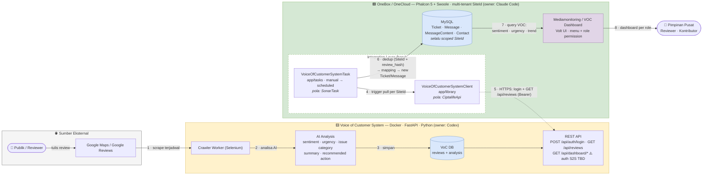

# Voice of Customer System × OneBox — Architecture Diagram

> Versi Mermaid (render otomatis di Obsidian & GitHub). Versi editable/presentasi: [voc_onebox_architecture.drawio](voc_onebox_architecture.drawio) — buka di app.diagrams.net / draw.io desktop / plugin VS Code / plugin Obsidian "Diagrams".
> Konvensi yang dipakai (Microsoft/AWS style): system boundary sebagai container, alur data bernomor kiri→kanan, warna konsisten per sistem, garis putus-putus = lintas boundary, ⚠️ = keputusan belum final.

## Diagram Konteks (Mermaid)

## Narasi Alur (untuk presentasi)

1. **Scrape** — Crawler VoC System (Selenium) mengambil review publik dari Google Maps secara terjadwal.
2. **Analisa** — AI menganalisa tiap review: sentiment, urgency, issue category, summary, recommended action.
3. **Simpan** — Review + hasil analisa disimpan di DB VoC System (dedup internal via `review_hash`).
4. **Trigger** — Di OneBox, `VoiceOfCustomerSystemTask` (pola SonarTask) jalan manual dulu, nanti terjadwal — iterasi per `SiteId`.
5. **Pull** — Task memanggil `VoiceOfCustomerSystemClient` (pola CiptalifeApi): login → `GET /api/reviews` lintas boundary via HTTPS + Bearer. ⚠️ auth service-to-service belum final.
6. **Ingest** — Dedup (`SiteId` + `review_hash`/`external_review_id`) → mapping field → `new Ticket()` + `Message` + `MessageContent` (+ `Contact` reviewer). Semua ber-`SiteId`.
7. **Query** — Dashboard VOC membaca tabel internal (bukan call API realtime) — konsisten keputusan "persist, bukan proxy".
8. **Akses** — User melihat dashboard sesuai role (menu + role permission existing).

## Catatan Desain (kenapa begini)

- **Persist ke `Ticket` existing, bukan tabel baru** — keputusan lead; mengikuti pola yang sudah berjalan (SonarTask → Ticket → Mediamonitoring).
- **VoC System tetap microservice terpisah** — Selenium/crawling tidak boleh pindah ke OneBox (boundary rule di MUST_READ).
- **Dashboard baca DB internal, bukan proxy API** — UI tetap hidup walau VoC System down; bisa di-scope SiteId native; reuse reporting existing.
- **Titik rawan yang digambar eksplisit**: (a) garis 5 = satu-satunya dependency runtime antar sistem; (b) ⚠️ auth S2S; (c) mapping SiteId ↔ location.

## Cara pakai / edit

| Kebutuhan | Cara |
|---|---|
| Lihat cepat | Buka file ini di **Obsidian** (Mermaid render otomatis) |
| Edit visual / presentasi | Buka `.drawio` di **app.diagrams.net** atau draw.io desktop |
| Edit .drawio di Obsidian | Install community plugin **"Diagrams"** |
| Import Mermaid ke draw.io | draw.io → Arrange → Insert → Advanced → Mermaid → paste blok di atas |
| Export gambar | draw.io → File → Export as → PNG/SVG (untuk Google Docs / slide report) |
