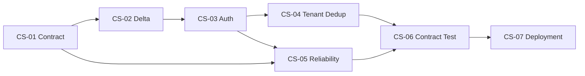

# Implementation Plan VoC Crawler System - Index

> Status: ready untuk implementasi
> Audit: 2026-07-13
> Boundary: hanya backend VoC Crawler System; OneBox adalah consumer read-only.

## Tujuan

Menjadikan Crawler System data provider yang aman, tenant-scoped, idempotent, dan dapat ditarik OneBox secara incremental. Semua task maksimal 5 MD termasuk coding, test, self-review, dan dokumentasi.

## Scope

In scope: FastAPI integration route/schema/dependency, SQLAlchemy service/model, Alembic, service auth, delta cursor, tenant/dedup integrity, fixture, contract test, observability, Docker/CI/runbook.

Out of scope: PHP client/task OneBox, Ticket/Message/Contact, Mediamonitoring/Volt, menu/role, scheduler OneBox, dan pemindahan Selenium ke OneBox.

## Baseline Terverifikasi

| Temuan | Bukti |
|---|---|
| Review.updated_at ada, tetapi belum ada sync watermark di response | models.py::Review; schemas.py::ReviewResponse |
| /api/reviews memakai page/page_size + offset | routers/reviews.py; ReviewService.get_reviews |
| Analysis append-only tidak menyentuh Review | AnalysisService._store_analysis |
| Auth masih JWT user dengan fallback secret | dependencies.py; routers/auth.py |
| review_hash unique global | models.py dan migration 20260619_0001 |
| company_id migration nullable, model non-null | migration 6a66329ddc12 vs models.py |
| Health tetap status ok saat DB gagal | routers/health.py::health_check |
| CI belum menguji migration di PostgreSQL | .github/workflows/deploy.yml |
| Baseline test | 9 passed: test_mvp + test_tenant_isolation |
| Baseline lint | 2 F401 existing dan tidak termasuk scope plan |

## Keputusan Final

| ID | Keputusan | Alasan |
|---|---|---|
| D-CS1 | GET /api/integration/v1/reviews; /api/reviews tetap | Tidak mematahkan FE existing |
| D-CS2 | Opaque bearer token key_id.secret; hash HMAC saja yang disimpan | Rotatable, revocable, tanpa password user |
| D-CS3 | Credential terikat company_id + scope reviews:read | Tenant tidak dipilih dari query |
| D-CS4 | Review.sync_updated_at diubah saat review atau latest analysis berubah | Late analysis ikut delta |
| D-CS5 | Snapshot + keyset cursor berisi watermark, id, tenant/filter fingerprint | Pagination stabil dan deterministik |
| D-CS6 | Sort ASC sync_updated_at,id | Cursor maju monoton |
| D-CS7 | UNIQUE(company_id, review_hash) | Selaras SiteId + review_hash OneBox |
| D-CS8 | Payload analysis flat, tanpa raw_payload/raw_response | Cocok untuk ingest dan aman |
| D-CS9 | Fixture deterministik adalah consumer contract | OneBox dapat mock tanpa live crawler |
| D-CS10 | Migration menjadi release step tunggal | Aman saat multi-replica |

## Task

| Task | MD | Dependency | Handoff OneBox |
|---|---:|---|---|
| [VOC-CS-01](VOC-CS-01_api-contract-fixture.md) API contract + fixture | 3 | - | RI-01,03,04,05 |
| [VOC-CS-02](VOC-CS-02_delta-sync-pagination.md) Delta + cursor | 5 | CS-01 | RI-05,08 |
| [VOC-CS-03](VOC-CS-03_service-auth.md) Service auth | 5 | CS-02 | RI-02,04 |
| [VOC-CS-04](VOC-CS-04_tenant-dedup-integrity.md) Tenant + dedup | 4 | CS-03 | RI-01,05,06 |
| [VOC-CS-05](VOC-CS-05_reliability-observability.md) Reliability | 4 | CS-01,03 | RI-04,09 |
| [VOC-CS-06](VOC-CS-06_contract-test-onebox-simulation.md) Contract/E2E | 5 | CS-01..05 | RI-03,04,05,08,16 |
| [VOC-CS-07](VOC-CS-07_deployment-runbook.md) Deploy/runbook | 3 | CS-06 | RI-16,17 |
| **Total** | **29** | | |

## Dependency

Migration chain linear: 495376efebcb -> 20260713_0001 sync -> 20260713_0002 api_clients -> 20260713_0003 tenant/dedup.

## Urutan Rilis

- MVP integration-ready: CS-01,02,03,04,06.
- Staging-ready: tambah CS-05 dan seluruh failure drill.
- Production-ready: CS-07, preflight data, backup, release migration, smoke dari jaringan OneBox.

## Blocker Eksternal

Keputusan teknis tidak menunggu review user. Saat implementasi/deploy hanya hal berikut membutuhkan pihak luar: nilai secret per environment, mapping location lama yang company_id-nya null, serta DNS/firewall OneBox ke VoC. Recommended default tetap dipakai untuk development.

## Guardrail

1. company_id selalu berasal dari service identity.
2. Jangan log token, secret, raw payload/response, atau review_text penuh.
3. /api/reviews existing tidak diubah secara breaking.
4. Datetime contract UTC ISO 8601.
5. Cursor memvalidasi version, tenant, filter, dan snapshot.
6. Checkpoint consumer maju hanya setelah semua page sukses.
7. Migration wajib punya preflight, upgrade, downgrade, verification.
8. PostgreSQL untuk migration test; SQLite hanya unit test.
9. Tidak ada target edit OneBox pada paket ini.

## Evidence Completion

Setiap task selesai harus mencatat commit/PR, command test, migration result, curl tersanitasi, request_id, serta deviasi. Status done hanya diberikan jika seluruh Definition of Done observable.
