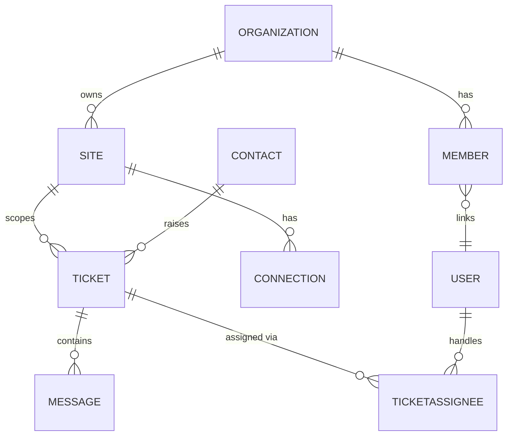

# Onebox / OneCloud — ERD (Entity Relationship Diagram)

> **Status:** Living document — dibangun dari dokumen "Onebox – DFD, ERD". Beberapa diagram masih menyusul. Lihat **Coverage Tracker** di bawah.
> **Tujuan:** Referensi tunggal struktur data Onebox untuk (a) developer dan (b) AI agent.
> **Companion:** [dfd.md](dfd.md) (alur data) · [ONEBOX_ONECLOUD_DEV_GUIDE.md](ONEBOX_ONECLOUD_DEV_GUIDE.md).
> **⚠️ Disclaimer:** Relasi & kardinalitas di bawah adalah **interpretasi dari diagram kotak-panah**, belum diverifikasi ke schema DB / `app/models/*.php`. Panah pada diagram sumber tidak selalu menunjukkan kardinalitas eksak. Verifikasi ke model asli sebelum dijadikan patokan foreign key. Setiap entity kemungkinan besar punya kolom **`site_id`** untuk tenant scoping meski tidak digambar.

---

## 🔑 Keputusan Terkunci (Review Intelligence) — dari lead Agung

Konfirmasi lead menetapkan bahwa fitur Review Intelligence **numpang pada entity `Ticket` yang sudah ada**, bukan tabel baru:
- Data review di-**persist ke table `Ticket`** ("sesuai yg sudah berjalan"), lewat modul **`Mediamonitoring`** existing.
- **Terverifikasi di kode:** `Ticket` sudah punya kolom **`Sentiment`** (`-1` neg / `0` netral / `1` pos). `MediamonitoringController` query `Ticket`+`Message`+`Attachment`+`File` dan sudah punya dashboard sentimen/pimpinan/kontributor + reportSLA/reportAnalisa/trendNews.
- Konsekuensi ERD: **entity kerja Review Intelligence = `Ticket`** (reviewer → `Contact`, isi review → `Message`/`MessageContent`, media asal → `Media`). Field analisa tambahan (urgency, issue_category, summary) ⚠️ perlu keputusan: kolom baru di `Ticket` vs `Reference`/`Data`.

---

## Peta Besar: 3 Entity Pusat

Seluruh ERD berputar di sekitar tiga entity:

- **`Site`** — tenant. Akar dari hampir semua data.
- **`User`** — identitas orang. Terhubung ke Site lewat `Member`.
- **`Ticket`** — unit kerja layanan pelanggan. Pusat domain "Case".



---

## Grup 1 — Package (Langganan / Lisensi)

Model katalog produk + paket yang dilanggan tiap site.

| Entity | Peran |
|--------|-------|
| `Product` | item produk yang dijual/ditawarkan |
| `ProductFactor` | faktor/atribut/pricing factor dari sebuah Product |
| `Benefit` | benefit/fitur yang bisa dipaketkan |
| `ProductBenefit` | jembatan Product↔Benefit (benefit apa untuk produk apa) |
| `SiteProduct` | produk yang dilanggan oleh sebuah Site |
| `SiteBenefit` | benefit aktif untuk sebuah Site (mis. jumlah channel, kuota) |
| `Site` | tenant pelanggan |

Relasi (interpretasi):
- `ProductFactor` — `Product`
- `Benefit` → `ProductBenefit` → `ProductFactor`/`Product`
- `Product` → `SiteProduct` → `Site`
- `Benefit`/`ProductBenefit` → `SiteBenefit` → `Site`

> **Kunci:** `SiteBenefit` = gerbang limit fitur per-site (dipakai `1.4.1 Create Channel` untuk validasi kuota channel). Kalau Review Intelligence jadi fitur berbayar/terpaket, di sinilah ia didaftarkan.

---

## Grup 2 — Site (Tenant + Billing)

| Entity | Peran |
|--------|-------|
| `Site` | tenant (pusat grup ini) |
| `Organization` | organisasi pemilik site |
| `Member` | jembatan `User`↔`Organization`/`Site` |
| `User` | akun orang |
| `Connection` | akun channel milik site |
| `License?` | ⚠️ lisensi site (tanda tanya ada di diagram asli — status belum pasti) |
| `Settings` | konfigurasi/branding site (logo, coloring) |
| `Invoice` | tagihan site |
| `PaymentMethod` | metode pembayaran untuk invoice |

Relasi: `Organization` → `Site`; `Organization` → `User`; `User` → `Member` → `Site`; `Connection` → `Site`; `Site` → `License?`; `Site` → `Settings`; `Site` → `Invoice` → `PaymentMethod`.

> **Interpretasi:** grup ini gabungan tenant-structure + billing. Ada model komersial nyata (`Invoice`, `PaymentMethod`) — konsisten dengan produk yang dijual cloud/on-premise.

---

## Grup 3 — User & Team (RBAC)

| Entity | Peran |
|--------|-------|
| `User` | akun orang |
| `Member` | keanggotaan user di organization/site |
| `Organization` | organisasi |
| `Site` | tenant |
| `Role` | peran (mis. Agent CS, Supervisor) |
| `UserRole` | jembatan `User`↔`Role` |
| `Position` | jabatan (⚠️ relasi belum jelas di diagram) |
| `Activity` | log aktivitas user |
| `Permission` | izin (⚠️ entity berdiri, relasi belum tergambar) |
| `Action` | aksi (komponen permission) |
| `Object` | objek target permission |
| `MemberRole` | ⚠️ **disorot (kemungkinan entity baru/usulan)** — role di level member |

Relasi inti: `Role` → `UserRole` → `User`; `Organization` → `Member` → `User`; `Organization` → `Site`; `User` → `Activity`.

> **Interpretasi:** RBAC bertingkat. `Permission`/`Action`/`Object` menyiratkan model izin granular (siapa boleh melakukan aksi apa pada objek apa). `MemberRole` yang di-highlight = kemungkinan arah pengembangan permission per-member. **Relevan:** kontrol akses fitur Review Intelligence harus lewat mekanisme Role/Permission ini, bukan bikin sendiri. (Bandingkan dengan `Menu`/`RoleMenu` yang ditemukan di `app/models/`.)

---

## Grup 4 — Case (Inti Layanan Pelanggan)

Grup terpadat. `Ticket` = pusatnya.

| Entity | Peran |
|--------|-------|
| `Ticket` | unit kerja/case (pusat) |
| `Contact` | identitas pelanggan/pengirim |
| `Prospect` | calon pelanggan (terhubung ke Contact) |
| `Message` | pesan dalam tiket |
| `MessageContent` | isi/body pesan |
| `MessageUser` | pengirim/penerima pesan |
| `TicketGroup` | tim/grup penanganan |
| `TicketAssignee` | penugasan tiket ke user |
| `Notes` | catatan internal pada tiket |
| `Data` | data tambahan pesan (⚠️ makna spesifik belum pasti) |
| `File` | berkas |
| `Attachment` | lampiran (menghubungkan File ke Message/Ticket) |
| `Activity` | log aktivitas |
| `Organization`, `Member`, `User`, `Site` | konteks tenant/identitas |

Relasi (interpretasi):
- `Prospect` — `Contact` — `Ticket`
- `Ticket` — `Message` — {`MessageContent`, `MessageUser`}
- `Ticket` — `Notes`, `Ticket` — `TicketGroup`, `Ticket` — `TicketAssignee` → `User`
- `Ticket` — `Data`, `Ticket`/`Message` — `Attachment` — `File`
- `Ticket`/`User`/`Contact` — `Activity`
- `Organization` → `Member` → `User`; `Organization` → `Site`; `Organization` → `TicketGroup`

```mermaid
erDiagram
    PROSPECT ||--o| CONTACT : "converts to"
    CONTACT ||--o{ TICKET : raises
    TICKET ||--o{ MESSAGE : contains
    MESSAGE ||--|| MESSAGECONTENT : has
    MESSAGE ||--o{ MESSAGEUSER : "sent by"
    TICKET ||--o{ NOTES : has
    TICKET }o--|| TICKETGROUP : "handled by"
    TICKET ||--o{ TICKETASSIGNEE : "assigned via"
    TICKETASSIGNEE }o--|| USER : to
    TICKET ||--o{ ATTACHMENT : has
    ATTACHMENT }o--|| FILE : references
    MESSAGE ||--o{ ATTACHMENT : has
```

> **Insight integrasi terbesar:** kalau review negatif/urgent dipetakan menjadi `Ticket` dan reviewer menjadi `Contact`, seluruh mesin assign→reply→resolve→SLA→report bisa dipakai ulang untuk memenuhi kebutuhan CEO "review bisa dikelola". Ini opsi B (invasif) — validasi dulu.

---

## Grup 5 — Messaging (Channel Infra)

| Entity | Peran |
|--------|-------|
| `Conversation` | percakapan (⚠️ relasi berdiri sendiri di diagram) |
| `Connection` | akun channel milik site |
| `Provider` | penyedia layanan channel |
| `Media` | jenis media/channel (Email, Sosmed, Livechat) |
| `Contact` | identitas pengirim |
| `Ticket`, `Message`, `MessageContent`, `MessageUser`, `Notes`, `TicketAssignee`, `File`, `Attachment`, `Data` | (lihat Grup 4) |

Rantai channel: `Connection` → `Provider` → `Media`. `Connection` menyuplai `Ticket`/`Message`; `Contact` → `Ticket`.

> **Interpretasi:** ini "pipa" masuknya pesan. `Media` = kategori channel, `Provider` = vendor/gateway, `Connection` = akun konkret. Kalau Review Intelligence jadi media source (opsi B), ia akan hidup sebagai `Media`/`Provider`/`Connection` baru.

---

## Grup 6 — Notification

| Entity | Peran |
|--------|-------|
| `Notification` | notifikasi (pusat grup) |
| `NotificationEvent` | event pemicu notifikasi |
| `Trigger` | aturan pemicu |
| `Template` | template isi notifikasi |
| `Media` | channel pengiriman |
| `User` | penerima (per user) |
| `Role` | penerima (per role) |
| `Object` | objek terkait notifikasi |
| `Message` | pesan yang dikirim (terhubung via Role) |

Relasi (interpretasi): `Notification` ↔ {`Media`, `User`, `Role`, `Object`}; `NotificationEvent` → `Notification`; `Trigger` → `NotificationEvent`; `Trigger` → `Template`; `Role` → `Message`.

> **Interpretasi:** engine notifikasi berbasis event/trigger/template, bisa ditarget ke user atau role, dikirim lewat media. ⚠️ Relevan kalau review urgent/patient-safety perlu memicu notifikasi otomatis ke supervisor.

---

## Grup 7 — Task

| Entity | Peran |
|--------|-------|
| `Task` | tugas/todo |
| `User` | pemilik/penerima task |
| `Object` | objek terkait task |
| `TypePriority` | tipe & prioritas task |

Relasi: `User` → `Task`; `Object` → `Task` → `TypePriority`.

> **Interpretasi:** domain task/todo terpisah dari Ticket. ⚠️ Keterkaitan ke Ticket belum tergambar.

---

## Kamus Entity (Master Index)

| Entity | Grup | Ada model? (⚠️ perlu cek `app/models/`) |
|--------|------|------------------------------------------|
| Site | Site | kemungkinan `Site.php` |
| Organization | Site/User | — |
| Member | Site/User | — |
| User | User | — |
| UserRole | User | — |
| Role | User | — |
| MemberRole | User (baru?) | — |
| Position, Permission, Action, Object | User | — |
| Product, ProductFactor, ProductBenefit | Package | `Product.php` ✅ (ditemukan) |
| Benefit, SiteProduct, SiteBenefit | Package | — |
| Invoice, PaymentMethod, License | Site | — |
| Settings | Site | — |
| Connection, Provider, Media | Messaging | — |
| Conversation | Messaging | — |
| Ticket, TicketGroup, TicketAssignee | Case | `Ticket.php` (disebut di guide) |
| Contact, Prospect | Case | — |
| Message, MessageContent, MessageUser | Case | — |
| Notes, Notification, Template | Case | — |
| Data, File, Attachment, Activity | Case | — |
| Category, Region, Reference, SiteReference | Master | `Reference.php` ✅, `Menu.php` ✅, `RoleMenu.php` ✅ (ditemukan) |
| Task, TypePriority | Task | — |

*Langkah verifikasi: `ls app/models/` lalu cocokkan nama file dengan entity di atas. Nama tabel dilihat dari `setSource()` di tiap model.*

---

## Ringkasan untuk AI Agent

- **Multi-tenant**: filter `site_id` di SETIAP query. Melewatkannya = kebocoran data antar tenant (bug paling kritikal).
- **Identity**: `User` tidak langsung ke `Site`; lewat `Member` (+ `Organization`). Role via `UserRole`/`Role`; izin granular via `Permission`/`Action`/`Object`.
- **Unit kerja**: `Ticket` adalah pusat. Punya status lifecycle (`Pending`/`Spam`/`Resolve`/`Close`), assignee, group, message, attachment, notes, activity.
- **Channel**: pesan masuk lewat `Connection`(akun) → `Provider`(vendor) → `Media`(jenis). Dibatasi kuota `SiteBenefit`.
- **Komersial**: `SiteProduct`/`SiteBenefit` (paket), `Invoice`/`PaymentMethod` (billing), `Settings` (branding).
- **Untuk fitur baru (mis. Review Intelligence)**: putuskan domain paralel (aman) vs. plug ke pipeline Ticket (native tapi invasif). Selalu lewati kontrol akses Role/Menu existing.

---

## Coverage Tracker

| ERD | Status |
|-----|--------|
| Case | ✅ |
| Package | ✅ |
| Site | ✅ |
| User, Team | ✅ |
| Messaging | ✅ |
| Notification | ✅ |
| Task | ✅ |
| Ticket (ERD view kedua) | ✅ (memperkuat grup Case; muncul entity `Comment?` ⚠️) |
| Prospect (ERD tersendiri?) | ❌ belum ada |
| Registration (ERD tersendiri?) | ❌ belum ada |
| Report/Dashboard (ERD tersendiri?) | ❌ belum ada |
| Verifikasi relasi & kardinalitas ke `app/models/` | ❌ belum dilakukan |

*Diperbarui seiring batch diagram berikutnya masuk.*
